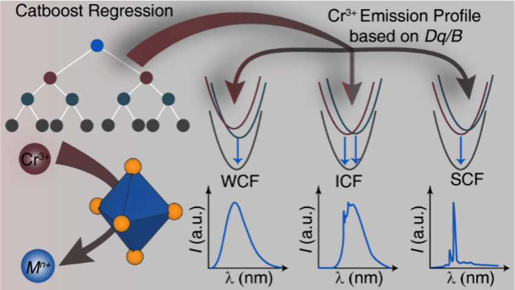

# DqBpredictor

**Predict the Crystal Field Splitting Parameter (Dq/B) of Cr3+-Substituted Phosphors**

This repository provides a machine learning model trained on experimentally reported Dq/B values for Cr³⁺-activated phosphors. Each compound in the dataset features a single crystallographically independent octahedral coordination site.

---

## 📑 Table of Contents
- [📚 Citations](#-citations)  
- [⚙️ Prerequisites](#-prerequisites)  
- [🚀 Usage](#-usage)  
  - [📄 Define Composition Features](#-define-composition-features)  
  - [🏗️ Define Structural Features](#-define-structural-features)  
  - [📄 Define the Prediction Set](#-define-the-prediction-set)  
  - [🔮 Predict Dq/B](#-predict-dqb)  
- [👨‍💻 Authors](#authors)  

---

## 📚 Citations

To cite the Dq/B prediction model, please reference the following work (or your own paper when published):

**Kumar, A., Akbar, A., Lesmes, H., Kavanagh, S. R., Scanlon, D. O., & Brgoch, J. (2025). Machine-Learning-Assisted Discovery of Cr3+-Based Near-Infrared Phosphors. Chemistry of Materials, 37(19), 7762-7770.

---

## ⚙️ Prerequisites

This package requires the following Python libraries:

- `pymatgen`  
- `catboost`  
- `scikit-learn`  
- `pandas`  
- `numpy`  
- `matplotlib`  
- `openpyxl`  

---

## 🚀 Usage

### 📄 Define Composition Features

Create an Excel file titled `To_get_compositional_features.xlsx` with a column labeled `"Formula"` listing the target compositions.  
Run `Get_descriptors.py` to automatically generate seven compositional features based on `elements.xlsx`.

**Output:** `Formula_with_compositional_features.xlsx`  
**Features Include:**
- Average Mulliken electronegativity  
- Average first ionization energy (kJ/mol)  
- Average metallic valence  
- Average Martynov-Batsanov electronegativity  
- Average number of outer shell electrons  
- Standard deviation of Mendeleev number  
- Maximum first ionization energy (kJ/mol)  

---

### 🏗️ Define Structural Features

1. Place all `.cif` files in the same directory.  
2. Run `CIF.py` to extract structural descriptors.

**Output:** `CIF_Structural_output.xlsx`

**Manually add the following using VESTA:**
- Maximum metal–ligand bond length  
- Polyhedral volume  

**Include the 1/R² value** based on the Cr³⁺ substitution site. Use the reference values below:

| Element | 1/R² |
|---------|------|
| Mg      | 90.70 |
| Sc      | 59.17 |
| Ti      | 9999.99 |
| Zr      | 90.70 |
| Hf      | 110.80 |
| Nb      | 90.70 |
| In      | 29.22 |
| Al      | 156.25 |
| Ga      | 40000.00 |
| Sn      | 177.78 |
| Sb      | 4444.44 |

---

### 📄 Define the Prediction Set

Prepare an Excel file titled `To_predict.xlsx` with a `"Formula"` column and 15 additional feature columns including conc. of Cr3+ (x)  
Refer to the example provided in the repository.

---

### 🔮 Predict Dq/B

After preparing the dataset:
- Run `dqb_Cr3+_Model.py`

The script will read from `Cr3_dqb_training_set.xlsx` and `To_predict.xlsx`, and generate:

**Output:** `final_prediction_with_uncertainty.xlsx`  

---

## 👨‍💻 Authors

This project was developed by **Amit Kumar**, under the guidance of **Prof. Jakoah Brgoch**.

